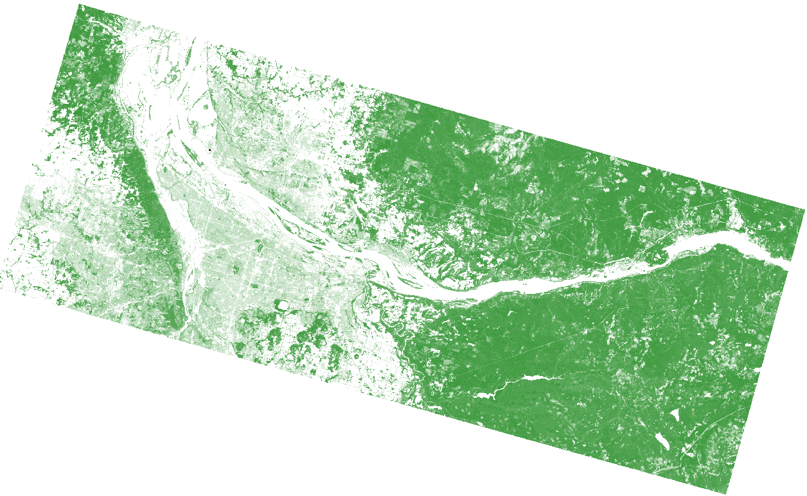
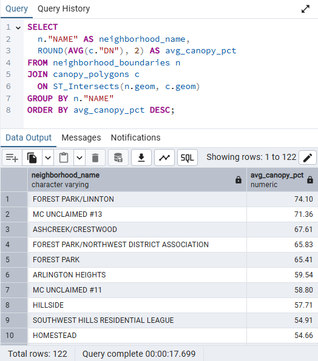

# Urban Tree Canopy Analysis: Portland, Oregon

## Objective
To analyze and visualize the percentage of urban tree canopy coverage across Portland neighborhoods using raster data from the National Land Cover Database (NLCD) and vector boundary data.

## 🛠Tools & Technologies
- **QGIS** – for raster processing, spatial data cleanup, and map layout
- **PostgreSQL + PostGIS** – for advanced spatial joins and SQL aggregation
- **NLCD Canopy Dataset (2019)** – for tree canopy percentage values
- **City of Portland Neighborhood Boundaries** – for geographic aggregation

## Workflow Overview

1. **Data Preparation in QGIS**
   
   - Downloaded NLCD Canopy raster (GeoTIFF)
     
   
   
   - Downloaded Portland neighborhood boundaries (GeoJSON) and filtered for Multnomah County.
     
   

   - Clipped the larger canopy raster to a county-sized area of interest around Multnomah County neighborhoods using QGIS.
     
   

   - Converted the clipped raster into polygons to enable vector-based analysis.
   
   

2. **Spatial SQL Analysis (PostGIS)**
   
   - Imported the canopy polygons and neighborhood boundaries into a PostGIS database.  (QGIS Database Manager shown below)
     
   

   - Grouped canopy polygons by raw canopy percentage value
     
   

   - Grouped canopy polygons into 10% bins and counted polygons per bin
     
   
   
   - Used `ST_Intersects` and `ST_Area` to calculate average canopy percentage per neighborhood.
     
   

3. **Data Aggregation and Visualization**
   
   - Created a new table based on the spatial analysis in the PostGIS database
     
   

   - Imported the table as a new layer back into QGIS.  (New attribute Table from QGIS shown below)
     
   
   
   - Styled the aggregated neighborhood layer in QGIS using graduated symbology weighted by average canopy percentage.
     
   

## Final Map
   
   - Created a print layout with a title, legend, scale bar, and data attribution.  PDF in '/Outputs'
     
   

## Key Results
- Tree canopy coverage varied significantly by neighborhood.
- Spatial disparities in coverage suggest potential for targeted urban forestry efforts in underserved areas.

## Skills Demonstrated
- Raster-to-vector conversion
- Spatial SQL with PostGIS
- Coordinate reference system alignment
- Spatial joins and aggregation
- Cartographic design in QGIS

## Outputs
- [`canopy_by_neighborhood.gpkg`](Outputs/canopy_pct_by_neighborhood.gpkg)
- [`Canopy_By_Neighborhood.png`](Outputs/multnomah_county_canopy_pct.pdf)
- SQL query files in `/Scripts`
- Project summary and documentation (this README)

## Next Steps
- Add census or demographic data to explore environmental equity implications.
- Expand project to include temporal change using historic NLCD data (e.g., 2001–2019).

---

*Project by [Ben Mihelic] – August 2025*
